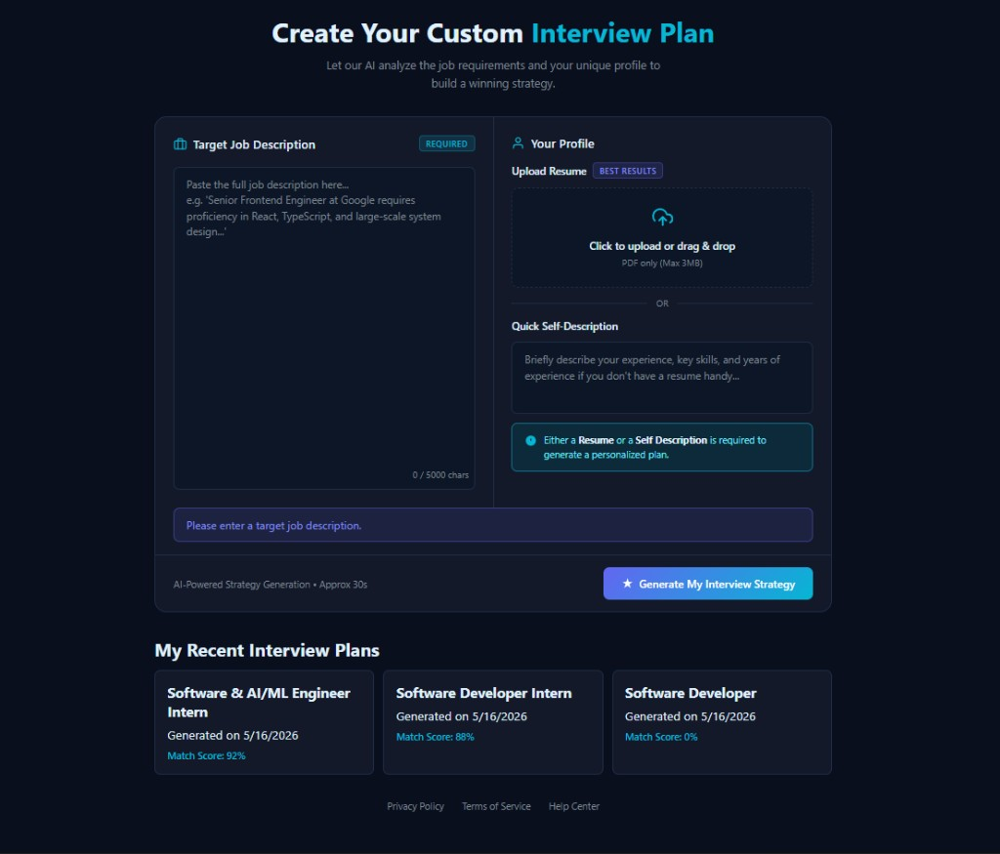
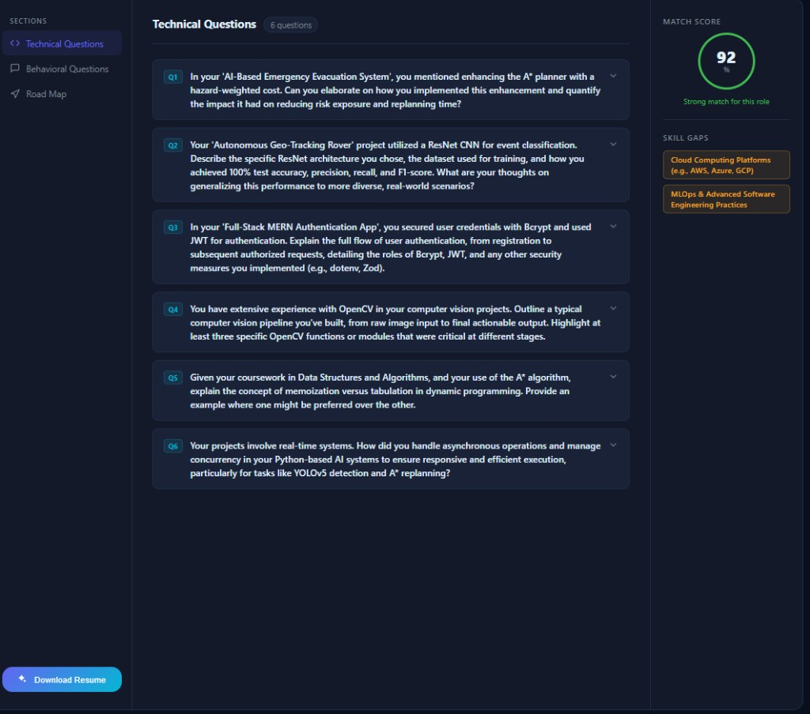
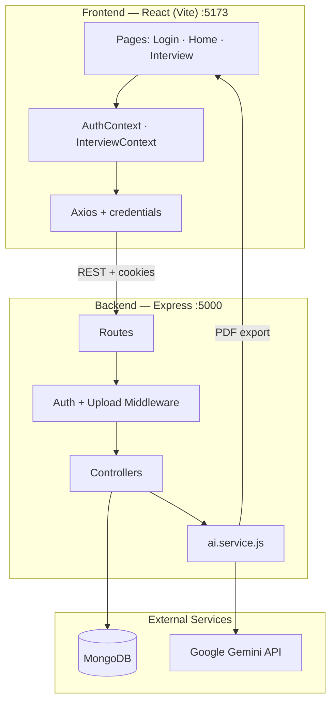

# InterviewIQ

**AI-powered interview preparation platform** built with React, Node.js, MongoDB & Google Gemini.

Paste a job description + resume (or self-summary) → get a **match score**, **skill gap analysis**, **technical & behavioral Q&A**, a **day-by-day prep roadmap**, and an optional **tailored resume PDF**.

<p align="center">
  
  
  
  
</p>

---

## UI Preview

### Home — Create interview plan
Job description input, PDF resume upload, self-description, recent plans, and one-click AI generation.

<p align="center">
  
</p>

### Interview dashboard — Generated report
Technical questions, behavioral section, roadmap, match score ring, skill gaps, and download resume.

<p align="center">
  
</p>

---

## What It Does

| Step | Action |
|------|--------|
| 1 | **Register / Login** — secure JWT session (HTTP-only cookies) |
| 2 | **Home** — paste job description + upload PDF resume or write a short profile |
| 3 | **Generate** — Gemini builds structured JSON (questions, gaps, roadmap, score) |
| 4 | **Dashboard** — explore Technical / Behavioral / Road Map tabs |
| 5 | **Download** — optional AI-tailored resume as PDF (Puppeteer) |

---

## Tech Stack

| Layer | Technologies |
|--------|----------------|
| **Frontend** | React 19, Vite 8, React Router 7, Axios, SCSS |
| **Backend** | Node.js, Express 5, Multer, pdf-parse |
| **Database** | MongoDB, Mongoose |
| **AI** | Google Gemini (`@google/genai`) — structured JSON output |
| **Auth** | JWT, bcrypt, cookie-parser, token blacklist |
| **PDF** | Puppeteer (HTML → PDF resume export) |
| **Validation** | Zod |

---

## System Architecture



### Request flow (generate plan)

```
User → Home.jsx → interview.api.js → POST /api/interview/
     → auth.middleware → multer (PDF) → interview.controller
     → pdf-parse → ai.service (Gemini) → MongoDB save
     → navigate → Interview.jsx → GET /api/interview/report/:id
```

---

## Project Navigator

Click any file to jump to it in the repo.

### Root

| File | Purpose |
|------|---------|
| [README.md](./README.md) | Project documentation |
| [.gitignore](./.gitignore) | Git ignore rules (env, node_modules, dist) |
| [docs/screenshots/](./docs/screenshots/) | UI preview images for README |

---

### Backend

| File | Purpose |
|------|---------|
| [Backend/server.js](./Backend/server.js) | Entry point — loads env, DB, starts Express on port 5000 |
| [Backend/package.json](./Backend/package.json) | Backend dependencies & scripts |

#### `Backend/src/`

| File | Purpose |
|------|---------|
| [app.js](./Backend/src/app.js) | Express app — CORS, JSON, mounts `/api/auth` & `/api/interview` |
| [config/database.js](./Backend/src/config/database.js) | MongoDB connection via `MONGO_URI` |

#### Routes

| File | Purpose |
|------|---------|
| [routes/auth.routes.js](./Backend/src/routes/auth.routes.js) | `POST /register`, `POST /login`, `GET /logout`, `GET /get-me` |
| [routes/interview.route.js](./Backend/src/routes/interview.route.js) | CRUD interview reports + resume PDF generation |

#### Controllers

| File | Purpose |
|------|---------|
| [controllers/auth.controller.js](./Backend/src/controllers/auth.controller.js) | Register, login, logout, getMe — JWT cookies |
| [controllers/interview.controller.js](./Backend/src/controllers/interview.controller.js) | Generate report, list/get reports, export resume PDF |

#### Middlewares

| File | Purpose |
|------|---------|
| [middlewares/auth.middleware.js](./Backend/src/middlewares/auth.middleware.js) | Verify JWT from cookie, check blacklist |
| [middlewares/file.middleware.js](./Backend/src/middlewares/file.middleware.js) | Multer memory storage for PDF upload (max 3MB) |

#### Models

| File | Purpose |
|------|---------|
| [models/user.model.js](./Backend/src/models/user.model.js) | User schema (username, email, hashed password) |
| [models/interviewReport.model.js](./Backend/src/models/interviewReport.model.js) | Interview plan schema (questions, gaps, roadmap, score) |
| [models/blacklist.model.js](./Backend/src/models/blacklist.model.js) | Invalidated JWT tokens on logout |

#### Services

| File | Purpose |
|------|---------|
| [services/ai.service.js](./Backend/src/services/ai.service.js) | Gemini prompts, JSON schema, report normalization, Puppeteer PDF |

---

### Frontend

| File | Purpose |
|------|---------|
| [Frontend/package.json](./Frontend/package.json) | Frontend dependencies & Vite scripts |
| [Frontend/index.html](./Frontend/index.html) | HTML shell |
| [Frontend/vite.config.js](./Frontend/vite.config.js) | Vite configuration |

#### `Frontend/src/` — Core

| File | Purpose |
|------|---------|
| [main.jsx](./Frontend/src/main.jsx) | React root mount |
| [App.jsx](./Frontend/src/App.jsx) | `AuthProvider` + `InterviewProvider` + router |
| [app.routes.jsx](./Frontend/src/app.routes.jsx) | Route definitions (login, register, home, interview) |
| [style.scss](./Frontend/src/style.scss) | Global styles + imports button styles |
| [style/button.scss](./Frontend/src/style/button.scss) | Shared `.button` / `.primary-button` styles |

#### `features/auth/`

| File | Purpose |
|------|---------|
| [auth.context.jsx](./Frontend/src/features/auth/auth.context.jsx) | Auth state — user, loading, `getMe` on mount |
| [hooks/useAuth.js](./Frontend/src/features/auth/hooks/useAuth.js) | Login, register, logout handlers |
| [services/auth.api.js](./Frontend/src/features/auth/services/auth.api.js) | Axios client — auth API calls |
| [components/Protected.jsx](./Frontend/src/features/auth/components/Protected.jsx) | Route guard — redirect to `/login` if no user |
| [pages/Login.jsx](./Frontend/src/features/auth/pages/Login.jsx) | Login form |
| [pages/Register.jsx](./Frontend/src/features/auth/pages/Register.jsx) | Registration form |
| [auth.form.scss](./Frontend/src/features/auth/auth.form.scss) | Auth page form styles |

#### `features/interview/`

| File | Purpose |
|------|---------|
| [interview.context.jsx](./Frontend/src/features/interview/interview.context.jsx) | Report list, current report, loading state |
| [hooks/useInterview.js](./Frontend/src/features/interview/hooks/useInterview.js) | Generate, fetch, list reports + PDF download |
| [services/interview.api.js](./Frontend/src/features/interview/services/interview.api.js) | Axios — interview API + multipart upload |
| [pages/Home.jsx](./Frontend/src/features/interview/pages/Home.jsx) | Job description + resume upload + generate CTA |
| [pages/Interview.jsx](./Frontend/src/features/interview/pages/Interview.jsx) | Report dashboard (questions, score, gaps, roadmap) |
| [style/home.scss](./Frontend/src/features/interview/style/home.scss) | Home page dark theme & layout |
| [style/interview.scss](./Frontend/src/features/interview/style/interview.scss) | Interview dashboard styles |

---

## API Reference

### Auth — `/api/auth`

| Method | Path | Auth | Description |
|--------|------|------|-------------|
| POST | `/register` | Public | Create account |
| POST | `/login` | Public | Sign in (sets cookie) |
| GET | `/logout` | Public | Sign out + blacklist token |
| GET | `/get-me` | Protected | Current user |

### Interview — `/api/interview`

| Method | Path | Auth | Description |
|--------|------|------|-------------|
| POST | `/` | Protected | Generate report (`jobDescription`, `selfDescription`, `resume` PDF) |
| GET | `/` | Protected | List user's past reports |
| GET | `/report/:interviewId` | Protected | Full report by ID |
| POST | `/resume/pdf/:interviewReportId` | Protected | Download tailored resume PDF |

---

## Getting Started

### Prerequisites

- Node.js 18+
- MongoDB (Atlas or local)
- [Google AI Studio](https://aistudio.google.com/) API key

### Install & run

```bash
# Backend
cd Backend
npm install
# Create Backend/.env (see below)
npm run dev

# Frontend (new terminal)
cd Frontend
npm install
npm run dev
```

Open **http://localhost:5173**

### Environment variables (`Backend/.env`)

```env
MONGO_URI=your_mongodb_connection_string
JWT_SECRET=your_long_random_secret
GOOGLE_GENAI_API_KEY=your_gemini_api_key

# Optional
GEMINI_MODEL=gemini-3-flash-preview
```

> Never commit `.env` — it is listed in [.gitignore](./.gitignore).

---

## Security

- Passwords hashed with **bcrypt**
- JWT in **httpOnly** cookies (`sameSite: lax`)
- Token **blacklist** on logout
- Interview data scoped per user
- CORS: `http://localhost:5173` (dev)

---

## Resume / Portfolio Blurb

**InterviewIQ** — AI interview prep app (React, Node.js, MongoDB, Google Gemini). Analyzes job description + resume to generate match score, skill gaps, and day-by-day prep roadmap with technical/behavioral Q&A and tailored resume PDF export.

---

## Author

Full-stack portfolio project — REST APIs, JWT auth, file uploads, structured AI output, and modern React architecture.
